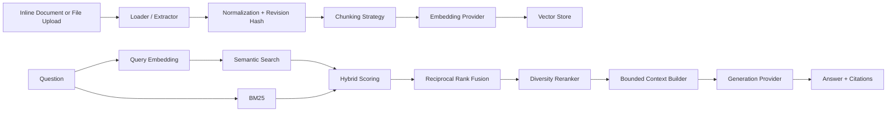

# RAG Engine From Scratch

A production-minded Retrieval-Augmented Generation engine built with NestJS and TypeScript from first principles, without LangChain or LlamaIndex.

The project keeps the important RAG mechanics explicit and replaceable: ingestion, normalization, chunking, embeddings, vector search, BM25, hybrid ranking, Reciprocal Rank Fusion, reranking, context construction, generation, citations, file extraction, versioning, and architectural boundaries.

## Why this project exists

RAG frameworks are useful, but they can hide the mechanics that matter when a system has to be debugged, evaluated, optimized, secured, or adapted to production constraints. This implementation keeps those mechanics visible so each stage can be reasoned about, measured, replaced, or scaled independently.

## Architecture



## Architectural principles

- **CQRS** separates index mutations from read-only RAG queries where the distinction is useful.
- **Dependency Inversion** keeps application logic independent from OpenAI and storage implementations.
- **Ports and Adapters** isolate embeddings, generation, vector storage, file extraction, chunking, fusion, and reranking.
- **Strategy Pattern** makes ranking and chunking behavior replaceable without rewriting orchestration.
- **Single Responsibility** keeps ingestion, retrieval, generation, document lifecycle, and transport concerns separated.
- **Explicit composition** favors understandable behavior over framework magic.
- **Untrusted retrieval context** is treated as data, never as instructions to the generation model.

## Project structure

```text
src/
├── common/                 # Health and HTTP exception handling
├── config/                 # Fail-fast environment validation
├── rag/
│   ├── api/                # HTTP controllers, DTOs and multipart transport
│   ├── application/        # Use cases, CQRS handlers and orchestration
│   │   ├── commands/
│   │   └── queries/
│   ├── domain/             # Models, ports and strategy contracts
│   ├── infrastructure/     # OpenAI, vector store, PDF/file extraction, BM25/RRF
│   └── rag.module.ts
├── app.module.ts
└── main.ts
```

## Ingestion pipeline

The ingestion path supports both inline content and uploaded documents.

1. Receive content or a file.
2. Detect/validate the source representation.
3. Extract PDF text when required.
4. Normalize text, Markdown, or HTML.
5. Compute a stable SHA-256 content hash.
6. Detect duplicate revisions.
7. Increment document version when content changes.
8. Split content through a pluggable chunking strategy.
9. Generate embeddings for every chunk.
10. Replace previous chunks for the same stable document id.
11. Persist new chunks through the `VectorStore` abstraction.

Supported upload types:

- `text/plain`
- `text/markdown`
- `text/x-markdown`
- `text/html`
- `application/pdf`

Uploads are memory-backed and limited to 10 MB. PDF files are signature-validated before text extraction.

## Chunking

The default `RecursiveChunkingStrategy` prefers meaningful boundaries instead of blindly cutting text:

1. paragraph boundary
2. sentence boundary
3. whitespace boundary
4. hard boundary as a final fallback

Chunk size is constrained by both a character budget and an approximate token budget, with configurable overlap.

## Retrieval pipeline

1. Embed the user question.
2. Generate a configurable semantic candidate pool.
3. Apply exact-match metadata filtering.
4. Compute BM25 lexical relevance over the filtered corpus.
5. Build weighted semantic + lexical scores.
6. Apply a configurable score threshold.
7. Fuse semantic and lexical rankings using Reciprocal Rank Fusion.
8. Remove near-duplicate evidence and limit repeated chunks from the same document.
9. Build a bounded generation context.
10. Generate an answer only from the supplied evidence.
11. Return the exact chunks used as citations.

## Hybrid retrieval

The baseline scorer combines cosine similarity with normalized BM25 evidence:

```text
hybridScore = semanticScore * 0.72 + bm25Score * 0.28
```

The two ranking signals are then fused with Reciprocal Rank Fusion (RRF). This avoids relying only on score calibration and rewards chunks that are consistently strong across independent rankings.

The scoring, fusion, and reranking stages live behind separate contracts so alternative approaches can be introduced without changing retrieval orchestration.

## Diversity reranking

The default reranker performs a deterministic post-retrieval pass that:

- removes near-duplicate chunks using token-set similarity;
- limits repeated evidence from the same document;
- preserves the highest-ranked evidence first;
- keeps the final context more diverse and useful for generation.

The reranker is intentionally a separate stage so a cross-encoder or model-based implementation can replace it later.

## Document lifecycle

Documents can use a stable id. Re-ingesting identical normalized content is detected as a duplicate and does not generate embeddings again.

When content changes:

- the revision version increments;
- previous chunks are removed;
- the new revision is embedded and indexed;
- `version` and `contentHash` are propagated into chunk metadata.

Deleting a document removes both its indexed chunks and in-memory revision state.

## CQRS

```text
POST /rag/documents
POST /rag/documents/upload
PUT  /rag/documents/:id
DELETE /rag/documents/:id
        ↓
      Commands
        ↓
Application handlers
        ↓
   RagService

POST /rag/query
        ↓
   AskRagQuery
        ↓
   AskRagHandler
        ↓
   RagService.query()
```

CQRS is used for operations whose read/write responsibilities genuinely differ. Internal components are not split into commands and queries merely for consistency.

## API

Swagger UI:

```text
http://localhost:3000/docs
```

Health endpoint:

```text
GET /health
```

### Ingest inline content

```bash
curl -X POST http://localhost:3000/rag/documents \
  -H "Content-Type: application/json" \
  -d '{
    "id": "architecture-notes",
    "title": "RAG Architecture Notes",
    "format": "markdown",
    "content": "# Retrieval\nHybrid retrieval combines semantic and lexical evidence.",
    "metadata": {
      "category": "architecture"
    }
  }'
```

### Upload a file

```bash
curl -X POST http://localhost:3000/rag/documents/upload \
  -F "file=@./architecture.pdf;type=application/pdf" \
  -F "title=Architecture Notes" \
  -F "id=architecture-notes" \
  -F 'metadata={"category":"architecture"}'
```

### Reindex a stable document

```bash
curl -X PUT http://localhost:3000/rag/documents/architecture-notes \
  -H "Content-Type: application/json" \
  -d '{
    "title": "RAG Architecture Notes",
    "format": "text",
    "content": "Updated architecture documentation."
  }'
```

### Delete a document

```bash
curl -X DELETE http://localhost:3000/rag/documents/architecture-notes
```

### Ask a question with metadata filters

```bash
curl -X POST http://localhost:3000/rag/query \
  -H "Content-Type: application/json" \
  -d '{
    "question": "How does hybrid retrieval work?",
    "topK": 5,
    "filters": {
      "category": "architecture"
    }
  }'
```

Example response:

```json
{
  "answer": "Hybrid retrieval combines semantic and lexical evidence. [S1]",
  "citations": [
    {
      "documentId": "architecture-notes",
      "chunkId": "architecture-notes:0",
      "title": "RAG Architecture Notes",
      "excerpt": "Hybrid retrieval combines semantic and lexical evidence...",
      "score": 0.0325
    }
  ]
}
```

## Running locally

Requirements:

- Node.js 22+
- OpenAI API key

```bash
cp .env.example .env
npm install
npm run start:dev
```

## Docker

```bash
cp .env.example .env
docker compose up --build
```

## Configuration

```env
PORT=3000
OPENAI_API_KEY=
OPENAI_EMBEDDING_MODEL=text-embedding-3-small
OPENAI_CHAT_MODEL=gpt-4.1-mini
RAG_CHUNK_SIZE=900
RAG_CHUNK_OVERLAP=150
RAG_CHUNK_MAX_TOKENS=300
RAG_TOP_K=6
RAG_MAX_CONTEXT_CHARS=12000
RAG_CANDIDATE_MULTIPLIER=5
RAG_MIN_SCORE=0
```

Critical configuration is validated before application startup.

## Testing and quality

The GitHub Actions quality gate runs:

```text
npm install
npm run lint
npm test -- --runInBand
npm run build
```

Useful local commands:

```bash
npm run lint
npm test
npm run test:cov
npm run build
```

Tests cover chunking, context construction, hybrid scoring, RRF, diversity reranking, metadata filtering, vector-store behavior, document revision/deduplication, end-to-end RAG orchestration, and uploaded-file validation.

## Security boundaries

Retrieved documents are treated as untrusted data. The generation system prompt explicitly instructs the model to ignore instructions embedded inside retrieved content and to answer only from supplied evidence.

The API also applies:

- strict DTO validation;
- unknown-field rejection;
- upload size limits;
- MIME validation;
- PDF signature validation;
- bounded generation context;
- consistent exception envelopes;
- no secrets committed to the repository.

## Design decisions

Detailed rationale is documented in:

- `docs/ARCHITECTURE.md`
- `docs/DECISIONS.md`
- `docs/PRODUCTION-READINESS.md`

### Why no LangChain or LlamaIndex?

The objective is to expose RAG mechanics rather than framework configuration. Important abstractions are implemented directly so their behavior, trade-offs, and failure modes remain visible.

### Why an in-memory vector store first?

The in-memory adapter keeps cosine similarity and index lifecycle explicit and makes tests deterministic. Application code depends on `VectorStore`, so persistent adapters can replace it without changing use cases.

### Why BM25 plus semantic retrieval?

Semantic similarity is strong at meaning, while lexical retrieval preserves exact identifiers, codes, names, acronyms, and domain terminology. Combining them provides a stronger baseline than using either signal alone.

### Why RRF after weighted scoring?

Weighted scores are useful for explicit relevance thresholds and diagnostics. RRF adds a rank-based fusion step that reduces sensitivity to the different numerical scales of semantic and lexical signals.

### Why a separate reranking stage?

Candidate generation, fusion, and final evidence selection solve different problems. Keeping reranking separate allows deterministic diversity today and model-based reranking later without changing retrieval orchestration.

## Current production boundary

This repository is intentionally production-minded rather than presented as a finished production platform. The current vector store and revision registry are in-memory and therefore process-local and non-durable.

High-value next extensions include:

- PostgreSQL + pgvector persistence;
- durable document/revision state;
- database-level metadata filtering;
- retrieval evaluation datasets and metrics;
- groundedness and citation evaluation;
- OpenTelemetry traces and Prometheus metrics;
- provider retries, backoff and circuit breakers;
- asynchronous ingestion for large document sets;
- authentication, authorization and tenant isolation.

## Engineering philosophy

The implementation favors explicit behavior, small replaceable components, dependency inversion, deterministic boundaries, and testability. Patterns are introduced only where they solve a concrete design problem; the objective is not to maximize abstraction, but to keep the system understandable as it evolves.

## License

MIT
