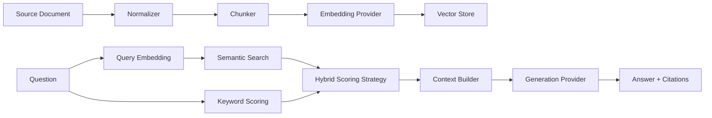

# RAG Engine From Scratch

A production-minded Retrieval-Augmented Generation engine built with NestJS and TypeScript from first principles, without LangChain or LlamaIndex.

The goal of this project is to make every important RAG decision explicit: document ingestion, chunking, embeddings, vector search, lexical scoring, hybrid ranking, context construction, generation, citations, and architectural boundaries.

## Why this project exists

RAG frameworks are useful, but they often hide the mechanics that matter when a system has to be debugged, evaluated, optimized, secured, or adapted to production constraints. This implementation keeps those mechanics visible and replaceable.

## Architecture



## Architectural principles

- **CQRS** separates ingestion commands from read-only RAG queries.
- **Dependency Inversion** keeps application logic independent from OpenAI and storage implementations.
- **Ports and Adapters** isolate embeddings, generation, vector storage, and retrieval scoring.
- **Strategy Pattern** makes ranking algorithms replaceable without changing retrieval orchestration.
- **Single Responsibility** keeps chunking, retrieval, generation, and transport concerns separated.
- **Explicit composition** favors understandable code over framework magic.

## Project structure

```text
src/
├── rag/
│   ├── api/                 # HTTP controllers and DTOs
│   ├── application/         # Use cases, CQRS handlers and orchestration
│   │   ├── commands/
│   │   └── queries/
│   ├── domain/              # Models, ports and strategies
│   ├── infrastructure/      # OpenAI adapters and vector-store implementation
│   └── rag.module.ts
├── app.module.ts
└── main.ts
```

## Retrieval pipeline

### Ingestion

1. Receive a source document.
2. Normalize its content.
3. Split it into overlapping chunks.
4. Generate embeddings for each chunk.
5. Persist chunk vectors through the `VectorStore` abstraction.

### Query

1. Embed the user question.
2. Run semantic similarity search.
3. Calculate lexical evidence.
4. Combine both signals using a pluggable scoring strategy.
5. Select the top-ranked chunks.
6. Build a constrained context.
7. Generate an answer using only that context.
8. Return source citations with ranking scores.

## Hybrid retrieval

The default implementation uses explicit weighted scoring:

```text
finalScore = semanticScore * 0.72 + keywordScore * 0.28
```

The formula intentionally lives behind `RetrievalScoringStrategy`. A different implementation, such as Reciprocal Rank Fusion or BM25-based ranking, can be introduced without modifying `RetrievalService`.

## CQRS

Write and read operations have different responsibilities:

```text
POST /rag/documents
    ↓
IngestDocumentCommand
    ↓
IngestDocumentHandler
    ↓
RagService.ingest()

POST /rag/query
    ↓
AskRagQuery
    ↓
AskRagHandler
    ↓
RagService.query()
```

CQRS is used here because ingestion changes the retrieval index while querying is read-only and follows a different execution path. It is not applied to internal operations that do not benefit from the separation.

## API

Swagger UI is available at:

```text
http://localhost:3000/docs
```

### Ingest a document

```bash
curl -X POST http://localhost:3000/rag/documents \
  -H "Content-Type: application/json" \
  -d '{
    "title": "RAG Architecture Notes",
    "content": "Retrieval augmented generation combines external retrieval with language-model generation.",
    "metadata": {
      "category": "architecture"
    }
  }'
```

### Ask a question

```bash
curl -X POST http://localhost:3000/rag/query \
  -H "Content-Type: application/json" \
  -d '{
    "question": "What does retrieval augmented generation combine?",
    "topK": 5
  }'
```

Example response:

```json
{
  "answer": "Retrieval augmented generation combines external retrieval with language-model generation. [S1]",
  "citations": [
    {
      "documentId": "...",
      "chunkId": "...:0",
      "title": "RAG Architecture Notes",
      "excerpt": "Retrieval augmented generation combines...",
      "score": 0.91
    }
  ]
}
```

## Running locally

Requirements:

- Node.js 22+
- OpenAI API key

```bash
cp .env.example .env
npm install
npm run start:dev
```

## Docker

```bash
cp .env.example .env
docker compose up --build
```

## Configuration

```env
PORT=3000
OPENAI_API_KEY=
OPENAI_EMBEDDING_MODEL=text-embedding-3-small
OPENAI_CHAT_MODEL=gpt-4.1-mini
RAG_CHUNK_SIZE=900
RAG_CHUNK_OVERLAP=150
RAG_TOP_K=6
```

## Testing and quality

The repository includes unit tests and a GitHub Actions workflow that runs tests and compiles the project on pushes and pull requests.

```bash
npm test
npm run test:cov
npm run build
```

## Design decisions

### Why no LangChain or LlamaIndex?

The purpose of this repository is to expose the mechanics of RAG rather than demonstrate framework configuration. The important abstractions are implemented directly so their behavior, trade-offs, and failure modes remain visible.

### Why an in-memory vector store first?

The first implementation keeps cosine similarity explicit and easy to inspect. The application layer depends on `VectorStore`, so a persistent adapter such as PostgreSQL/pgvector, Qdrant, Weaviate, or another vector database can replace it without changing the use cases.

### Why provider interfaces?

Embedding and generation models evolve quickly. Application logic should not depend directly on a single vendor SDK. `EmbeddingProvider` and `GenerationProvider` provide stable boundaries around those external dependencies.

### Why hybrid search?

Semantic similarity is strong at meaning, while lexical matching can preserve exact identifiers, acronyms, codes, names, and domain terminology. Combining both signals provides a more robust baseline than relying on either signal alone.

## Current limitations

This repository intentionally starts with a compact, understandable core. The current in-memory vector store is not persistent and the lexical score is deliberately lightweight.

Planned production-oriented extensions include:

- BM25 lexical retrieval
- Reciprocal Rank Fusion
- dedicated reranking stage
- metadata filters
- pgvector or Qdrant adapter
- document loaders and parsers
- token-aware chunking
- retrieval evaluation datasets
- groundedness and citation evaluation
- structured logging and metrics
- request tracing
- rate limiting and resilience policies

## Engineering philosophy

The implementation favors explicit behavior, small replaceable components, dependency inversion, deterministic boundaries, and testability. Patterns are introduced only where they solve a concrete design problem; the objective is not to maximize abstraction, but to keep the system understandable as it evolves.

## License

MIT
